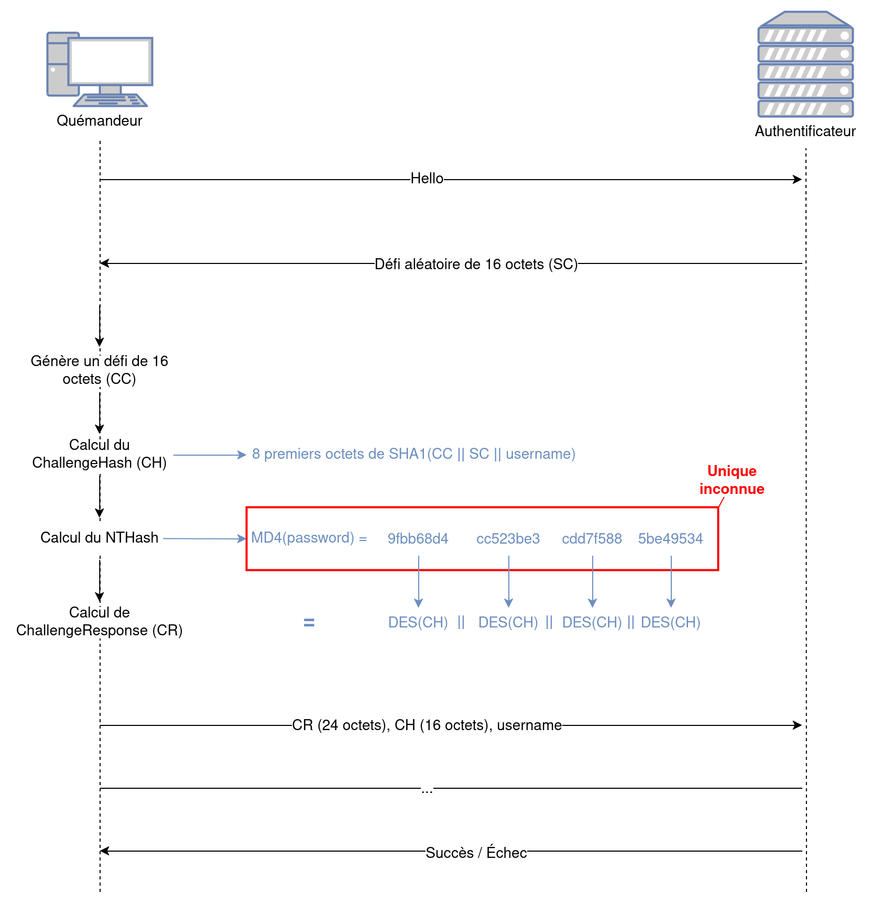

# Projet NET4104

## Introduction

Ce projet vise à exploiter une faiblesse de configuration rencontrée dans la majorité des réseaux WPA2-Entreprise. En effet, il est très courant que les clients n'aient pas mis en oeuvre la validation du certificat CA, ce qui permet à un tier d'usurper l'identité d'un point d'accès Wi-Fi utilisant le mécanisme de sécurité WPA2-Entreprise.

En particulier, on s'intéressera aux réseaux utilisant le protocole d'authentification PEAP-MSCHAPv2 pour sa popularité. En l'espèce, on montrera dans quel mesure la faiblesse de configuration susmentionnée permet d'obtenir l'empreinte MD4 du mot de passe de l'utilisateur.

## La procédure d'authentification PEAP-MSCHAPv2

### EAP

### MSCHAPv2

Le protocol MSCHAPv2 est un protocole d'authentification de type CHAP (*Challenge Handshake Authentication Protocol*). L'objectif de cette classe de protocoles est de permettre à un client de s'authentifier en respectant les critères suivants :
- pas d'échange en clair du mot de passe ou d'une empreinte de celui-ci ;
- rejouabilité des échanges de nul effet pour un tier qui l'aurait intercepté.

Pour y parvenir, les protocoles de type CHAP réclament une preuve d'identité du client en lui demandant de répondre à un défi qui ne peut être relevé que par une entité connaissant le mot de passe. Par exemple, il pourrait être demandé au client de chiffrer un nombre aléatoire (fourni par l'authentificateur) avec le mot de passe (chose qui ne peut être réalisée qu'en connaissant le mot de passe).

Le protocole MSCHAPv2 fonctionne de la manière suivante :



1. Le serveur d'authentification envoie 16 octets aléatoires au client (le défi, *SC*) ;
2. Le client, pour prouver son identité, réalise :
    - Génération d'un défi de 16 octets (*CC*) ;
    - Calcul du `ChallengeHash` (*CH*) : `SHA1(CC || SC || username)` ;
    - Calcul de l'empreinte MD4 du mot de passe ;
    - Calcul de la réponse au défi à partir de l'empreinte du défi ;
3. Le client envoie au serveur le nom d'utilisateur et la réponse au défi ;
4. Le serveur vérifie la réponse au défi en vérifiant que la réponse du client est correcte, et accepte ou non l'authentification.

Ainsi la seule inconnue pour un attaquant qui intercepte les échanges est l'empreinte MD4 du mot de passe de l'utilisateur, qui est utilisé pour construire les trois clés DES utilisées pour calculer la réponse au défi. Tout autre élément du protocole est soit envoyé en clair, soit facilement déductible des échanges.

## L'attaque

Supposons que nous souhaitons nous authentifier auprès d'un réseau Wi-Fi utilisant le protocole PEAP-MSCHAPv2. Pour obtenir les informations d'authentification de d'un utilisateur du réseau cible, diffuser un point d'accès Wi-Fi avec le même SSID que le réseau cible suffit, à condition que les clients tentent de s'y connecter en ne vérifiant pas le certificat CA du serveur d'authentification.

Dès lors, nous pouvons nous concentrer auprès de la méthode d'authentification (MSCHAPv2), et remarquer que l'empreinte MD4 du mot de passe de l'utilisateur est suffisante pour s'authentifier en ce qu'elle agit comme le mot de passe lui-même.

### Attaque par dictionnaire ?

Une première approche pour obtenir le mot de passe de l'utilisateur pourrait être de réaliser une attaque par dictionnaire sur l'empreinte MD4. Par exemple, on pourrait simplement calculer l'empreinte MD4 d'un grand nombre de mots de passe possibles, s'en servir pour calculer la réponse à un défi et comparer avec la réponse fournie par le client.

Le problème de cette approche est que la réussite de cette attaque n'est pas garantie, car le mot de passe de l'utilisateur peut être complexe et ne pas figurer dans le dictionnaire.

### Attaque par force brute ?

Dans la mesure où le mot de passe de l'utilisateur est susceptible d'avoir une longueur arbitraire et d'être composé de caractères d'un large ensemble, il pourrait être intéressant d'attaquer par la force brute l'empreinte MD4 du mot de passe elle-même. Mais cette empreinte est de 128 bits, soit $2^{128}$ possibilités, ce qui est bien trop grand pour être réalisable en un temps raisonnable.

### Diviser pour mieux régner

L'empreinte MD4 que nous essayons d'obtenir est utilisée comme la clef de trois chiffrements DES. Les clés DES étant de 7 octets, chaque opération DES utilise un morceau de 7 octets de l'empreinte MD4. Ainsi, au lieu de chercher l'empreinte MD4 elle-même, on pourrait chercher les trois clés DES qui permettent de la construire. Dès lors, plus besoin d'attaquer par la force brute une empreinte de 128 bits, mais trois clés de 56 bits chacune.

Comme il y a 3 opérations DES et que ces opérations sont indépendantes les unes des autres, on a une complexité globale de $3 \times 2^{56} = 2^{57.59}$, ce qui est bien mieux que $2^{128}$.

Mais il y a quelque chose qui ne va pas. En l'espèce, nous avons besoin de trois clefs DES de 56 bits pour un total de 168 bits, alors que l'empreinte MD4 n'en fait que 128 : il manque 40 bits. Lors de la réalisation de MSCHAPv2, Microsoft a palié à ce problème en ajoutant 40 bits nuls à l'empreinte MD4, rendant la troisième clef DES d'une longueur effective de 16 bits.

Ainsi, il n'y a que $2^{16}$ possibilités pour cette dernière clef DES, ce qui est tout à fait réalisable par la force brute. La complexité totale de l'attaque est donc de $2^{56} + 2^{56} + 2^{16} = 2^{57}$. C'est considérablement mieux.

```
    Clef 1          Clef 2          Clef 3
+-------------+  +-----------+   +-----------+
|?|?|?|?|?|?|?|  |?|?|?|?|?|?|   |?|?|0|0|0|0|
+-------------+  +-----------+   +-----------+
```

